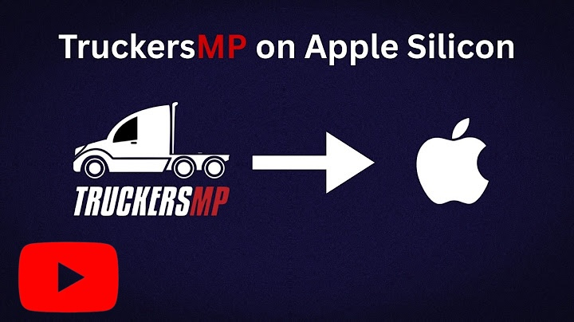

# TruckersMP for macOS


A macOS launcher for [TruckersMP](https://truckersmp.com) the ETS2 multiplayer mod and ATS multiplayer mod built with Electron (for now). Under the hood it wraps [truckersmp-cli](https://github.com/truckersmp-cli/truckersmp-cli) and can either use **CrossOver Wine** or a fully self-contained **Standalone Wine** build to launch the game.

> **Beta release (v2.4.1 Beta) — things are subject to change.** 

<p align="center">
  
</p>

---

Need a video tutorial? Here!      ↴      
<a href="https://www.youtube.com/watch?v=zh7L3ah6Bvo">
  
</a>

---
## Features

### Launch & Game Control
- **One click launch** into TruckersMP multiplayer or ETS2/ATS singleplayer
- **American Truck Simulator (ATS) support** — a dedicated ATS icon in the game launch UI automatically scans for your ATS game path so you can launch straight into TruckersMP for ATS
- **Start Steam** independently then **Launch ETS2 MP *or* ATSMP** once it's up
- **Stop / Force Kill** correctly terminates all Wine processes


### Two Wine Backends
Switch between backends per game from the sidebar toggle:
- **CrossOver Wine** uses an existing CrossOver install and bottle
- **Standalone Wine** fully independent, no CrossOver required. The launcher manages its own Wine builds bottle and DXMT install for you

### Path Management
- **Auto detect** for `truckersmp-cli`, Wine, Bottle, Steam directory, and game directory (works for both backends — **Auto detect Paths** in Standalone Wine settings)
- **Detection badges** (Found and Not found) in the sidebar
- **Browse buttons** and **Open Bottle in Finder**
- **↻ Re-detect** 

### Standalone 
- **Setup Wizard** installs the latest Wine build and DXMT release automatically.
- **Wine version manager** install multiple Wine builds side by side, mark one **active**, uninstall old ones
- **Status checklist** Wine installed / Bottle ready / DXMT version, each with a ✓
- **Bottle Path** **Steam Directory inside bottle**, and **ETS2/ATS Game Directory inside bottle**, independently configurable
- **Launch winecfg** and **Reinstall DXMT** shortcuts
- **Wine Command runner** — run Wine commands (e.g. `regedit`, `explorer`) directly to the bottle
- **Wine Log** toggleable debug logging with **Open in Finder**
- **Automatic Font Installation** — required TruckersMP fonts are now installed automatically when a bottle is created
- **Keep Plugins Toggle** — a "Keep plugins after install" option in settings lets you preserve installed plugins across reinstalls
- **Wine Log Options** — dedicated logging options added for the Wine log

### Live Log Viewer
- **Real-time log streaming** with colour coded output (info / warn / error / success / system)
- **Log Settings Menu**, featuring:
  - **Category tabs** to filter between All / Wine / Launcher output
  - **Filter bar** to search log output on the fly
  - **Timestamps** and **auto scroll** toggles
  - **Clear** button to reset the log
  - **Reduce Clutter** launcher does its best its can to only give important logs and reduce repeated logs.

### TruckersMP Server Status & Live Traffic
- **Live server list** pulled from the TMP API — shows player count and server status
- **Live "Busiest Traffic" view** — powered by the Trucky API, toggle the servers card header to view real time map congestion, player counts, and severity levels
- **Favourites** star your main servers favourites pin to the top of the list
- **Auto refresh** on a configurable interval (see Launcher Options), plus manual refresh

### TMP Info & Events
- **In game time, latest TMP version, supported ETS2 version** at a glance, with manual refresh
- **Upcoming events** list pulled from the TMP API with date, type, and server
- **"ON THIS MAC" section** — pulls from active logs to show your current game and client version


### Playtime Tracking
- **Playtime card** in the left sidebar tracks and displays your total playtime as well as your last session's playtime

### Sidebar Customization
- **Edit Sidebar** (Settings → Launcher Options) — toggle which cards show up in the left sidebar (Status, Playtime, TruckersMP Servers, Detection, Command Preview) and right sidebar (TMP Info, Upcoming Events, Player Finder)
- **Appearance Options** — customizable Accent Color and Background Color settings, with custom color pickers available
- **Transparency & Blur Toggles** — dedicated Transparency and Blur buttons so you can pick whichever fits your style

### Discord Rich Presence
- **Enable/disable Discord RPC**
- **Improved ETS2 city coordinates** — experimental option under Rich Presence Extras for more accurate "Near: / In:" city detection, including an optional merged list that updates live mid session
- **Fix wrong model option** — resolves telemetry switching issues on Volvo FH trucks by retaining the last saved model name
- **Set ETS2MP Logs Folder** + **Force Watch Chat Log** — scans today's `chat_YYYY_MM_DD` log every 5 seconds for "Connected to XXXXXX" / "Connection established" to auto detect when you've joined a server
- **Auto reconnect Discord** — retries every 20s while the game is running
- **Enable Advanced RPC** — shows truck + route (requires an ETS2 telemetry plugin)
- **Discord RPC Session ID** — with the release of the TruckersMP SDK, Rich Presence can now show your Session ID via a launcher-developed plugin that auto installs and configures itself on start

### Other Settings
- **MetalFX Spatial Upscaling** — support for MetalFX upscaling to boost performance on older hardware by rendering at a lower resolution and upscaling it (similar to DLSS)
- **Singleplayer mode** — bypasses TruckersMP login and launches ETS2/ATS directly
- **Metal HUD overlay** — shows GPU/CPU stats in game, works with either backend
- **Retina Mode** toggle
- **Disable Steam Overlay** — option under Launch Options to disable the Steam overlay when running ETS2 or ATS
- **Show Wine Activity section** toggle for the log panel
- **Extra CLI arguments**
- **Rebindable keyboard shortcuts** — click a binding, press a new key combo, or reset all to defaults
- **Server status & TMP info refresh interval** — configurable dropdown (default: every 1 minute)
- **Settings persistence** at `~/.config/truckersmp-launcher/settings.json`
- **Reset & Uninstall** — remove launcher settings (permanently deletes `~/.config/truckersmp-launcher/`) without leaving the app
- **About tab** — version info and **Check for Update**
- **TMP & Wine Update Notifications** — in-app notifications whenever a new TruckersMP or Wine update is available
- **Settings Layout Reorganization** — "Show quit animations" is now located under "Show macOS notification"
- **Launch Game Controller settings** — launches wine Game controller menu
### Keyboard Shortcuts
Defaults (all rebindable in Settings → Launcher Options):

| Shortcut | Action |
|---|---|
| `⌘L` | Launch game |
| `⌘.` | Stop game |
| `⌘S` | Start / Stop Steam |
| `⌘R` | Refresh servers |
| `⌘K` | Clear log |
| `⌘,` | Open Settings |

---

## Requirements

| Dependency | Notes |
|---|---|
| Apple Silicon Mac | Required for [DXMT](https://github.com/3Shain/dxmt), Preferably macOS Tahoe  |
| [truckersmp-cli](https://github.com/truckersmp-cli/truckersmp-cli) | Install via `pip3 install truckersmp-cli` |
| Euro Truck Simulator 2 | Must be installed via Steam inside a Wine bottle |
| American Truck Simulator | Must be installed via Steam inside the a Wine bottle like ETS2 |
| **Either:** [CrossOver](https://www.codeweavers.com/crossover) (free trial available) **or nothing else** | Standalone  manages its own Wine build — no CrossOver purchase/trial needed |

> [!WARNING]
> This app supports **macOS Sequoia and above**. **macOS Sonoma** may work but isn't guaranteed Older versions are not supported.

> As of [DXMT 0.72](https://github.com/3Shain/dxmt/releases#release-v0.72), experimental Intel Mac support was added — Apple Silicon is still recommended, but Intel Macs may work.

> As of now Standalone Wine mode currently installs **Wine 11.0** and **DXMT 0.80**.

> its not mandatory to install ATS with ETS or opposite choose which multiplayer you would like to join and install the game you want based on that.
---

## Setup

### Standalone Wine Mode (recommended — no CrossOver needed)
1. Open Settings → **Wine Mode** → select **Standalone Wine**
2. Click **Open Setup Wizard** and follow the prompts — it installs Wine, prepares the bottle, and installs DXMT for you
3. Once the checklist shows **Wine installed ✓ / Bottle ready ✓ / DXMT ✓**, click **Auto-detect Paths** to locate Steam and ETS2 inside the bottle (or set **Bottle Path**, **Steam Directory**, and **ETS2 Game Directory** manually)
4. Click **Start Steam**, wait for it to finish starting up
5. Hit **Launch ETS2 MP *or* ATS MP**

If you need to install a different Wine build later, use **+ Install New** under Wine Versions, then mark the one you want as active.

### CrossOver Mode
1. Launch the app — it will try to **auto detect** all paths on first run. Detection badges in the sidebar show what was found.
2. If anything is missing, use the **Browse** buttons in Settings to set paths manually:
   - **truckersmp-cli path** — usually `~/.local/bin/truckersmp-cli`
   - **Wine (CrossOver) path** — inside `/Applications/CrossOver.app/...`
   - **CrossOver Bottle** — your bottle with Steam + ETS2/ATS installed (usually named "Steam")
   - **Steam directory** — the Steam folder inside the bottle (auto detected from the bottle path)
   - **Game directory** — the ETS2/ATS folder inside the bottle (auto detected from the Steam directory)
3. Click **Start Steam** and wait for it to start up.
4. Hit **Launch ETS2 MP *or* ATS mp**.

### Installing truckersmp-cli

```bash
pip3 install truckersmp-cli
```

If `pip3` isn't available, install Python 3 from [python.org](https://www.python.org/downloads/) first.

---
## Discord Rich Presence Setup

The launcher ships with a default Discord Application ID already configured — Rich Presence works out of the box, no setup required.

1. Make sure **Enable Discord Rich Presence** is checked in Settings.
2. Done!

### Rich Presence extras

- **Advanced RPC** — shows truck, route and city requires an ETS2 telemetry plugin. The launcher uses [Funbit ETS2 Telemetry Server](https://github.com/funbit/ets2-telemetry-server)

> [!NOTE]
> Telemetry / Advanced RPC is still early and still being worked on you might encounter some errors while using it. When installing it keep pressing "Ok" and ignore the errors. (This is for Versions under 2.4.1)
---

## Troubleshooting


1. **"TruckersMP for macOS.app" Not Opened Apple could not verify "TruckersMP for macOS.app" is free of malware that may harm your Mac or compromise your privacy.**
- Since this app isn't signed (due to me not having an apple developer account) you will get this message but dont fret it can be easily bypassable! Open **Settings** scroll down till you see **Privacy and Security** click it then Scroll down and you will find TruckersMP for macOS 
- Click **Open Anyway** type your password or use TouchID and then done! app will now open without any issues or touching the terminal!                 
**why do we have todo this? since I dont profit off this app so nothing covers the 99$ apple charges every year for an Apple developer account.**

2. **truckersmp-cli not found**
- Run `pip3 install truckersmp-cli`, then click **↻ Re-detect** in the sidebar.

3. **Game launches but crashes immediately**
- On CrossOver, try switching translators (DXMT is recommended on Apple Silicon). On Standalone Wine,  Restart your Mac or try **Reinstalling DXMT** , **Deleting Bottle** and starting setup from scratch

4. **Wine processes linger after stopping**
- if this happens dont worry about it the moment you close the launcher it does a last verification sweep that all wine processes are closed if one is still running it will be closed.

5. **Discord RPC not working**
- Make sure Discord is running if still doesnt work open an issue and provide the launcher log.

6. **Slight pink shadow on the truck / steering wheel**
- Go into ETS2 graphics settings and set reflection quality to High. This is a known rendering quirk that sometimes resolves itself after a TruckersMP or DXMT update.

7. **I keep getting "wine discord ipc bridge has encountered a serious problem"**
- either disable discord rpc in settings (Also disables the launchers custom rpc) or run TruckersMP and in settings disable discord rpc.

8. **when trying to use the ingame radio my game freezes**
 - make sure in wine configuration (winecfg) that your microphone is set to your macbook microphone or headphones and not system default

9. **the contrast in game is really high and messing with my eyes**

- Toggle the "Disable HDR reprensation" button under launch options in settings `Tested on standalone wine mode works perfectly` for Crossover users the toggle doesnt work for some reason either try upgrading DXMT version via CXpatcher and try am still searching for a fix.

10. **Controller vibration doesn't work over Bluetooth**
- If the game still doesn't send over the game rumble after upgrading to Wine CrossOver 11.0, click the **Launch Controller Settings** button and make sure under **Advanced Settings** that **Enable SDL** is toggled on and **Disable hidraw** is on. Enabling **Disable hidraw** may cause the touchpad to be unusable until that option is disabled again.


---

## Uninstalling

The in app **Reset & Uninstall** button (Settings → About) only clears `~/.config/truckersmp-launcher/`. To fully remove the app, delete these three locations:

1. **The app itself**
   - `/Applications/TruckersMP For macOS.app`

2. **App data** (Wine builds, bottles, DXMT)
   - `~/Library/Application Support/TruckersMP-Launcher`

3. **Launcher config** (settings, keybinds, saved paths)
   - `~/.config/truckersmp-launcher`
---
## Contributing

PRs and issues welcome. If you hit a crash or a path detection failure, please open an issue and include the contents of the log panel (and Wine Log, if using Standalone Wine mode).

---

## Acknowledgements

This project was developed with AI assistance — what started as an idea became a reality with its help. 
Inspired by [matyash12's unofficial TruckersMP macOS launcher](https://github.com/matyash12/unofficial-truckersmp-macos-launcher).

---

## Credits

this project uses the following tools:

- **[Wine](https://www.winehq.org/)** — Windows compatibility layer. (the project TruckersMP for macOS uses this custom built [Wine](https://github.com/nohero765/wine-builds-))
- **[CodeWeavers/CrossOver](https://www.codeweavers.com/crossover)** — This project's custom Wine build Uses CodeWeavers' CrossOver patches. Thank you for their years of upstream Wine contributions. 
- **[DXMT](https://github.com/3Shain/dxmt)** — DirectX to Metal translation layer used in place of D3DMetal.
- **[truckersmp-cli](https://github.com/truckersmp-cli/truckersmp-cli)** — Used to launch TruckersMP and install TMP files.
- **[Funbit ETS2 Telemetry Server](https://github.com/Funbit/ets2-telemetry-server)** — Used for Telemetry Tab and exact coordinates of the truck/car

 a big thank you for these developers who developed these tools the project wouldn't have been possible without their hard work.


___

## Disclaimer

This project is an independent, open-source launcher for TruckersMP on macOS. It is not affiliated with, endorsed by, or sponsored by TruckersMP or SCS Software. All trademarks and copyrights belong to their respective owners.

## License

GPL-3.0
